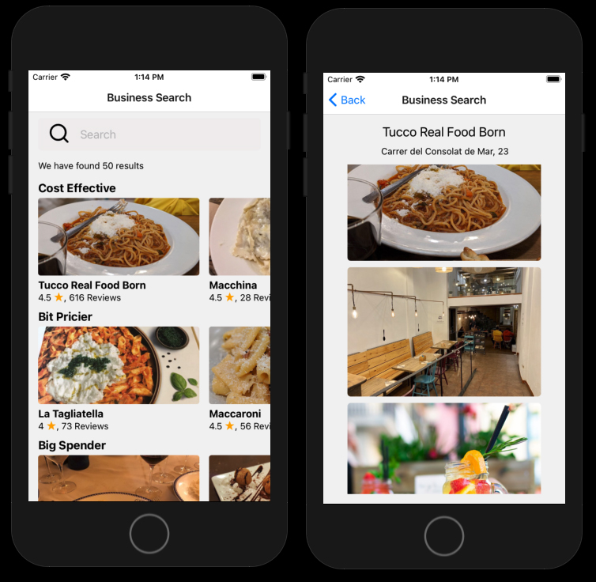

# FOOD APP

---

 
App built on React Native that uses Yelp's API to search for restaurants in the Barcelona area. When you click on the name of one of the restaurants, a screen with detailed photos and the address of the restaurant is displayed. This is part of an exercise from Stephen Grider's Udemy course.
